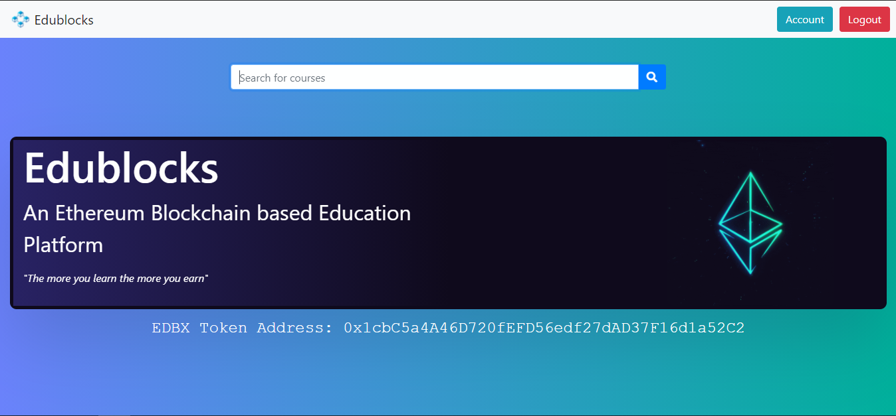
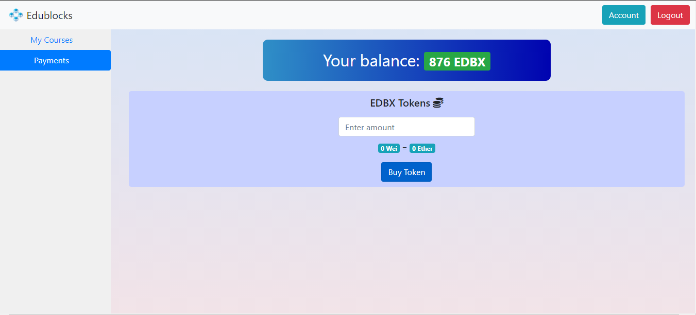

# EduBlocks - Blockchain Based E-Learning Platform

6th Semester Minor Project on Blockchain/Smart Contract applications in Education

## Features

- Online market-place for students, educators, content-creators, developers etc. to publish and purchase courses
- Custom ERC-20 standard Token (EDBX) for all transactions
- Rewards for students in the form of cryptocurrency
- Elegant UI for smooth and intuitive experience
- Security, authenticity, transparency and automation of tasks implemented using Smart Contracts

## UI

#### Homepage

#### Profile

#### Assignment Submission

#### Payments

## Tech Stack:

- Node.js
- React
- Bootstrap
- Express
- MongoDB
- Solidity
- Web3.js
- Truffle
- Ganache
- Metamask

#### Video Demo: https://www.youtube.com/watch?v=dhDUIfHSLo8
