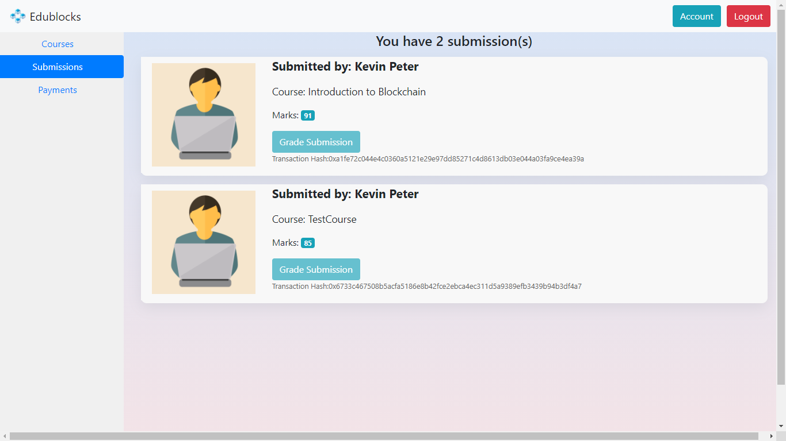

# EduBlocks - Blockchain Based E-Learning Platform

6th Semester Minor Project on Blockchain/Smart Contract applications in Education

## Features

- Online market-place for students, educators, content-creators, developers etc. to publish and purchase courses
- Custom ERC-20 standard Token (EDBX) for all transactions
- Rewards for students in the form of cryptocurrency
- Elegant UI for smooth and intuitive experience
- Security, authenticity, transparency and automation of tasks implemented using Smart Contracts

## UI

#### Homepage

#### Profile

#### Assignment Submission

#### Payments

## Tech Stack:

- Node.js
- React
- Bootstrap
- Express
- MongoDB
- Solidity
- Web3.js
- Truffle
- Ganache
- Metamask

## How to Run

1. Deploy Contracts and Import Accounts
   - Prerequisites: Install Metamask Chrome extension, Truffle CLI and Ganache GUI. 
   - Open Ganache and start a new workspace.
   - Open Truffle CLI, and go to {download_path}/client
   - Type "truffle migrate --reset" (since Migrations folder already exists in this repo). Otherwise, type "truffle compile"
   - The contracts should now be deployed on host: 127.0.0.1, port: 8545 (default). Confirm by going to Contracts tab or run "truffle networks" in the CLI.
   - Open Chrome browser, enable Metamask extension, go to settings and add new RPC network. Import your 10 accounts using 48 phrase mnemonic code from Ganache.

2. Run MongoDB & Express Server
   - Open new terminal, run "mongod" to start the daemon.
   - Open new terminal, go to {download_path}/server and type "npm start"
   - You should see "Server up and running on port: {port}" and "Mongoose Connected Woohoo" in the terminal

3. Run React App
   - Open new terminal, go to {download_path}/client and type "npm start"
   - You should now be greeted with the homepage :D
 
#### Video Demo: https://www.youtube.com/watch?v=dhDUIfHSLo8
